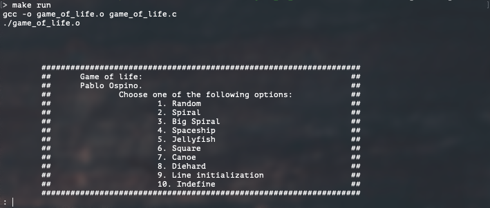
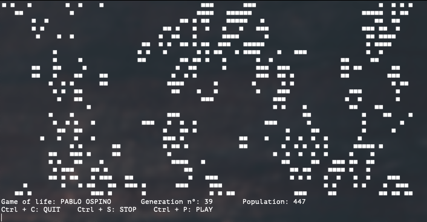
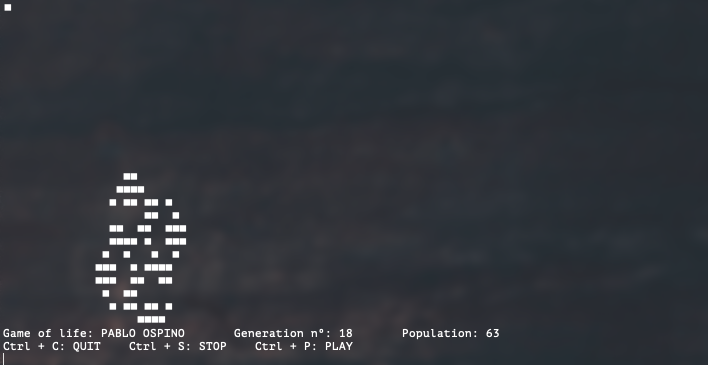

<h1 align="center">Welcome to game_of_life 👋</h1>
<p>
  
</p>

> Conway's game of life 

If you don't know what Conway's is check this [link](https://en.wikipedia.org/wiki/Conway%27s_Game_of_Life)

## Stack

- `C`: programming language.

## Features

You have different initializations.



One Example is the random initialization.


Another one is the Spiral initialization.


## Execute

- You need to have installed in your computer a c compiler.
```
make run
```

## Author

👤 **Pablo Ospino Sánchez**

* Github: [@ospinooo](https://github.com/ospinooo)

## Show your support

Give a ⭐️ if this project helped you!

***
_This README was generated with ❤️ by [readme-md-generator](https://github.com/kefranabg/readme-md-generator)_